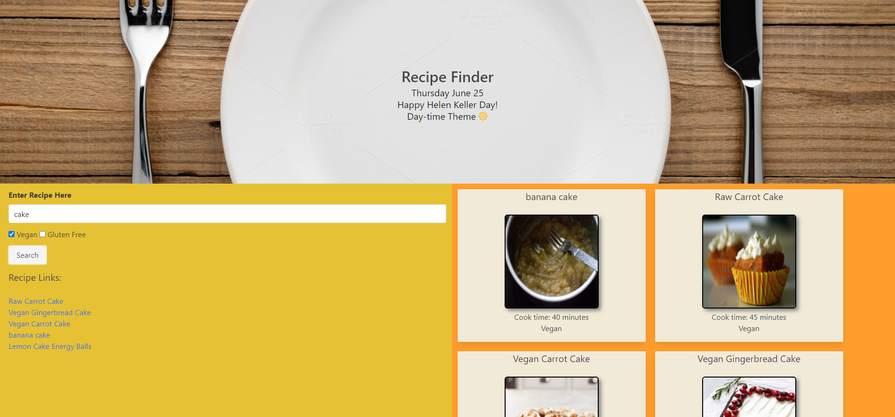

# Recipe Finder

## Link to presentation slideshow
## https://docs.google.com/presentation/d/1jaaaQ5KEzA7XRJYnyjuwDBQWyiYvxF2pMM_YboyIo-4/edit?usp=sharing
## Link to deployed application
## https://proflonghair07.github.io/Recipe_Finder/
## Screenshot of deployed application
## 
## Server-side api's: "Recipe-Food-Nutrition", "Holidays".
## Third party api: day.js
## css framework: bulma

## Minimum functionality:
## Using the Recipe-Food-Nutrition api allow the user to search for recipes by name and set criteria. When the user inputs a recipe name in the search input they should be given five results. Have the results be anchors that link to recipe in new tab. They will have two checkboxes as well. One for if the dish is vegan and one for if it is gluten-free. If neither are selected they will be ignored.
## The Holidays api will be used to render whatever the current holiday is to the header.
## The day.js api will be used to display the current date in the header. It wall also be used to tell the page what time of day it is and display a daytime them if it is before 7pm or a nighttime theme if it is after 7pm.

## Extra functionality:
## Use day.js to change class if it is the weekend.
## Use local storage to save recipes.
